# arista_2tier

## Start

事前に Arista ポータルサイトから cEOS のコンテナイメージをダウンロードしビルドしてください。詳細については Containerlab のドキュメントをご確認ください。

```bash
cd arista_2tier
sudo containerlab deploy
```

```bash
# login
ssh  clab-arista_2tier-node2-1
Warning: Permanently added 'clab-arista_2tier-node2-1' (ED25519) to the list of known hosts.
(admin@clab-arista_2tier-node2-1) Password:  # password admin
Last login: Mon Aug 12 09:57:50 2024 from 172.20.20.1
node2-1>enable
node2-1#
```

## Diagram



## Parameter

### policy

#### AS number

Tier 2 Spine は AS65000 を利用し、Tier 1 Leaf は 65001 から昇順に割り当てます。  
異なる Tier 間の接続は eBGP によって実装されます。

#### BGP Underlay peer

EVPN peer および、VXLANトンネルの確立の下準備として、アドレス到達性を確保するために利用される Underlay peer は IPv6 link-local address を利用します。  
[RFC 8950](https://datatracker.ietf.org/doc/html/rfc8950) で定義されている方法を用いて、 IPv6 アドレスピアから IPv4 アドレスファミリを伝搬します。
redistribute connected を利用し再配送を行いますが経路情報を最小限に抑えるため、再配送するアドレスは Route-map で Loopback インタフェースのアドレスに制限します。

#### BGP Overlay peer

EVPN コントロールプレーンで各 NLRI の伝搬を行うために利用されます。Loopback0 をソースインタフェースとし、各ノードを接続します。
設定を簡略化するためピアリンクには dynamic neighbor を用います。

#### VXLAN Service interface

VLAN-based Service interface による EVI の生成を行います。  
RT値は \<vid>:\<vni>、RD値は [RFC 7432](https://datatracker.ietf.org/doc/html/rfc7432#section-7.9) で推奨される Type 1 RD を参考に \<router-id>:\<vid> を利用します。

#### EVPN source interface

インタフェース Loopback0 を利用し、203.0.113.0/29 のアドレスを割り当てます。

#### VXLAN source interface

インタフェース Loopback1 を利用し、203.0.113.8/29 のアドレスを割り当てます。

#### Ethernet Segment

node1-2, node-1-3 間でESIピアを構成し Ethernet Segment を用いたマルチホーム接続を行います。

- ESI Type
  - Type0 で手動で ESI は 0011:1111:1111:1100:0000 を設定する。
- LACP SystemID
  - ESI の10バイトの内、後方から数えて6バイトの値を設定する。
- ES import route-target
  - ESI の10バイトの内、先頭の1バイト（ESI Type）をのぞいた9バイトの内、先頭から6バイトの値を設定する。

### Assign

| host    | asn   | evpn        | vxlan        | Vlan10    | Vlan20     | Vlan30     |
|---------|-------|-------------|--------------|-----------|------------|------------|
| node1-1 | 65001 | 203.0.113.2 | 203.0.113.8  | 192.0.2.1 |            | 192.0.2.17 |
| node1-2 | 65002 | 203.0.113.3 | 203.0.113.9  | 192.0.2.1 | 192.0.2.9  |            |
| node1-3 | 65003 | 203.0.113.4 | 203.0.113.10 | 192.0.2.1 | 192.0.2.9  |            |
| node2-1 | 65000 | 203.0.113.0 |              |           |            |            |
| node2-2 | 65000 | 203.0.113.1 |              |           |            |            |
| client1 |       |             |              | 192.0.2.2 |            | 192.0.2.18 |
| client2 |       |             |              | 192.0.2.3 | 192.0.2.10 |            |

| Name   | Prefix         | Desc                   |
|--------|----------------|------------------------|
| evpn   | 203.0.113.0/29 | EVPN peer address      |
| vxlan  | 203.0.113.8/29 | VXLAN endpoint address |
| Vlan10 | 192.0.2.0/29   | Client Network 1       |
| Vlan20 | 192.0.2.8/29   | Client Network 2       |
| Vlan30 | 192.0.2.16/29  | Client Network 3       |

## Lisence

このプロジェクトは MIT ライセンスに基づいてライセンスされています。詳細については、[LICENSE.txt](LICENSE.txt) ファイルを参照してください。
